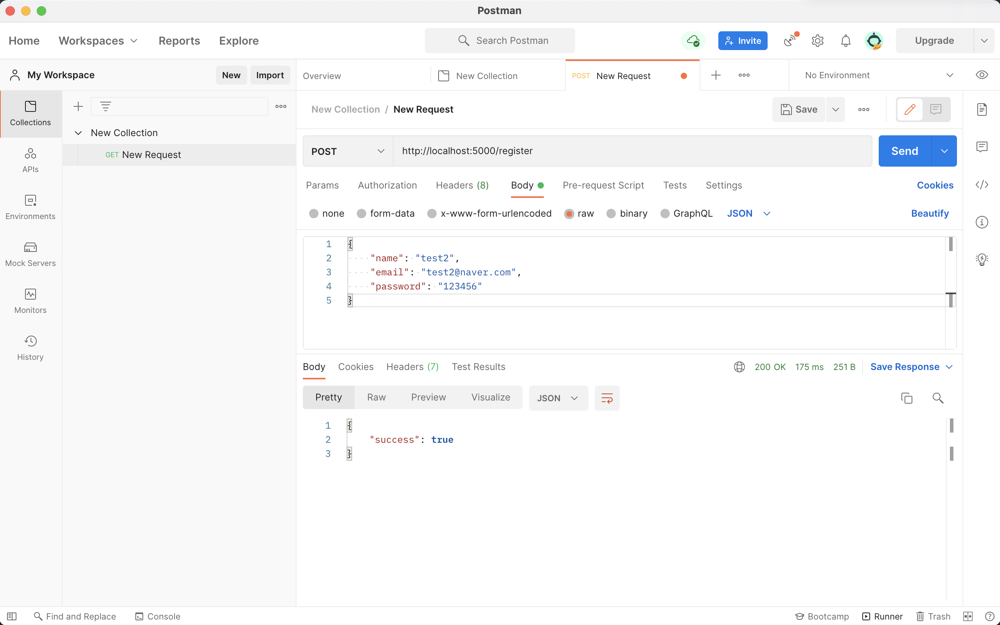
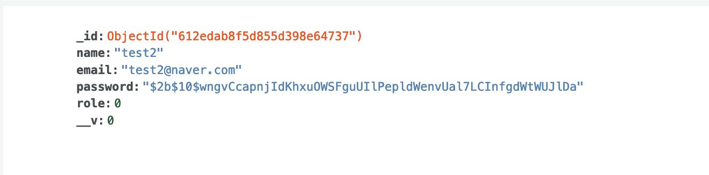

# bcrypt

: nodeJS에서 패스워드를 암호화하기 위해 사용되는 모듈

- salt로 난수를 추가해 복잡도 증가시킴(보안을 높이기 위해)

### install

`npm i bcrypt`

### import

`const bcrypt = require('bcrypt')`

### User save 전에 적용

User.js

```javascript
userSchema.pre("save", function (next) {
  const user = this;
  //비밀번호가 바뀌면
  if (user.isModified("password")) {
    //비밀번호 암호화
    bcrypt.genSalt(saltRounds, function (err, salt) {
      if (err) return next(err);

      bcrypt.hash(user.password, salt, function (err, hash) {
        if (err) return next(err);
        user.password = hash;
        next();
      });
    });
    //비밀번호 이외에 다른게 변경되면
  } else {
    next();
  }
});
```

index.js

```javascript
//사용자 정보 입력 -> 전송 -> req.body
app.post("/register", (req, res) => {
  //회원가입할 때 필요한 정보를 클라이언트에서 가져오면 데이터베이스에 넣어준다.
  const user = new User(req.body);

  //mongoDB에서 오는 메서드
  user.save((err, userInfo) => {
    if (err) return res.json({ success: false, err });
    return res.status(200).json({
      success: true,
    });
  });
});
```

### 결과 확인

postman


mongoDB

